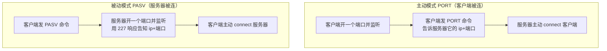
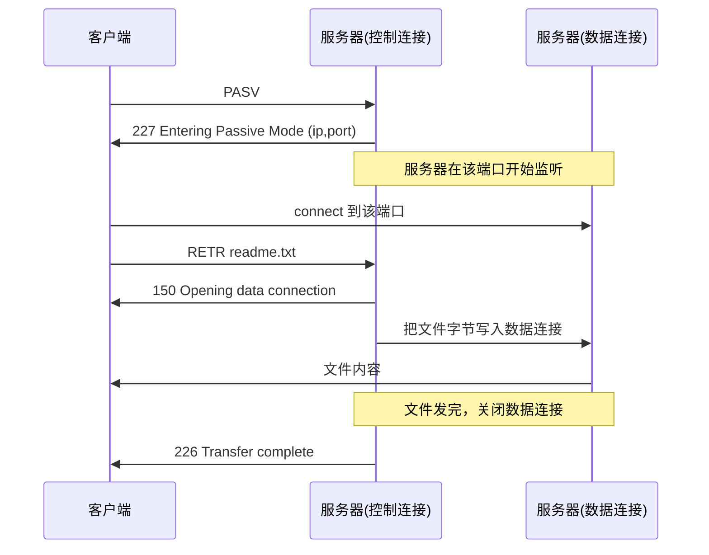
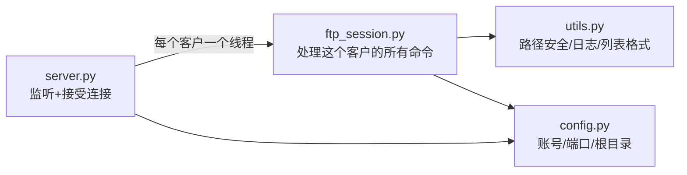
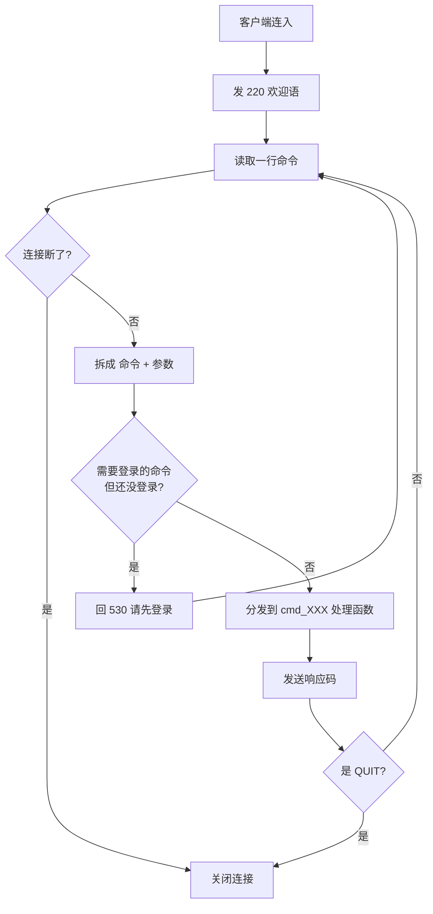
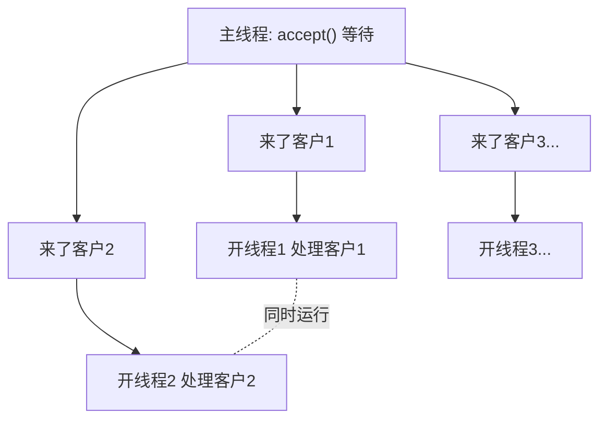

# 从零实现 FTP 服务器 · 完整学习教程

> 《计算机网络》课程设计（题目 9）· Python 实现
> 这份教程假设你只会一点 Python，从最基础的网络概念讲起，一步步带你把整个 FTP 服务器实现出来。每一步都解释「为什么这么做」，而不只是「怎么做」。

---

## 目录

1. [我们要做一个什么东西](#1-我们要做一个什么东西)
2. [前置知识：socket 是什么](#2-前置知识socket-是什么)
3. [FTP 协议原理（重点）](#3-ftp-协议原理重点)
4. [整体架构与流程](#4-整体架构与流程)
5. [第 0 步：写一个最小 TCP 服务器](#5-第-0-步写一个最小-tcp-服务器)
6. [第 1 步：发欢迎语，建立命令循环](#6-第-1-步发欢迎语建立命令循环)
7. [第 2 步：USER / PASS 登录认证](#7-第-2-步-user--pass-登录认证)
8. [第 3 步：路径安全（防止越权）](#8-第-3-步路径安全防止越权)
9. [第 4 步：目录浏览 PWD / CWD](#9-第-4-步目录浏览-pwd--cwd)
10. [第 5 步：数据连接 PASV / PORT（难点）](#10-第-5-步数据连接-pasv--port难点)
11. [第 6 步：目录列表 LIST（dir）](#11-第-6-步目录列表-listdir)
12. [第 7 步：下载 RETR（get）](#12-第-7-步下载-retrget)
13. [第 8 步：上传 STOR（put）](#13-第-8-步上传-storput)
14. [第 9 步：并发，支持多客户端](#14-第-9-步并发支持多客户端)
15. [测试与演示](#15-测试与演示)
16. [学习检查清单](#16-学习检查清单)

---

## 1. 我们要做一个什么东西

FTP（File Transfer Protocol，文件传输协议）是互联网上很早就有的、专门用来在两台机器之间传文件的协议。我们要做的不是去「用」FTP，而是自己「写一个 FTP 服务器程序」——让别人的 FTP 客户端（比如 Windows 自带的 `ftp` 命令）能连上我们的程序，登录、看文件列表、下载和上传文件。

打个比方：FTP 服务器就像一个「文件管理员」。客户端是来访的客人。客人进门要先报上姓名和密码（登录），管理员核对身份后才放行；客人说「我想看看有哪些文件」（dir），管理员把清单递出来；客人说「这份我要带走一份」（get），管理员复印一份交给他。我们要做的，就是把这个「管理员」用代码实现出来。

最终效果是这样的，在 Windows 命令行里：

```
C:\> ftp 192.168.1.10
220 Welcome to PyFTP server
用户: user
331 Password required for user
密码: 123456
230 User user logged in
ftp> dir
（列出文件清单）
ftp> get readme.txt
（下载成功）
ftp> bye
221 Goodbye
```

那些 `220` `331` `230` 就是 FTP 的「响应码」，后面会专门讲。

## 2. 前置知识：socket 是什么

要让两台机器通信，操作系统提供了一个叫 **socket（套接字）** 的东西。你可以把 socket 想象成「电话」：一方拨号、一方接听，接通后双方就能互相说话（收发数据）。

服务器和客户端的 socket 用法不太一样：

- **服务器**：先「装一部电话并公布号码」（bind 绑定地址端口），然后「等电话」（listen + accept）。每接到一个来电（accept），就得到一条专门和这个客户通话的线路。
- **客户端**：直接「拨号」（connect）到服务器的地址端口，接通后说话。

在 Python 里，一个最简单的服务器骨架是这样：

```python
import socket
s = socket.socket(socket.AF_INET, socket.SOCK_STREAM)  # 创建 TCP socket
s.bind(("0.0.0.0", 2121))   # 绑定到本机所有网卡的 2121 端口
s.listen()                   # 开始监听
conn, addr = s.accept()      # 阻塞等待，直到有客户端连进来
data = conn.recv(1024)       # 收数据
conn.sendall(b"hello")       # 发数据
conn.close()                 # 挂断
```

几个关键概念解释一下：

- `AF_INET` 表示用 IPv4 地址；`SOCK_STREAM` 表示用 TCP（可靠、有序、像水流一样的字节流）。FTP 用的就是 TCP。
- `bind(("0.0.0.0", 2121))`：`0.0.0.0` 意思是「本机所有网卡都监听」，`2121` 是端口号。端口就像一栋楼里的房间号，一台机器上不同程序用不同端口区分。
- `accept()` 会「阻塞」——程序会停在这里等，直到真有客户端连进来，才返回一条新连接 `conn` 和对方地址 `addr`。
- TCP 是「字节流」：你发过去的数据没有天然的「一条一条」的边界，需要自己用换行符之类的方式切分。这点对后面解析命令很重要。

## 3. FTP 协议原理（重点）

这一节是整个项目最该理解透的地方。FTP 有两个特别之处。

### 3.1 一问一答的文本协议

FTP 的控制命令是**纯文本、一行一条**，客户端发一条命令，服务器回一条响应。响应格式固定为 **「三位数字 + 空格 + 说明文字」**，例如：

```
客户端 ->  USER alice
服务器 <-  331 Password required for alice
客户端 ->  PASS secret
服务器 <-  230 User alice logged in
```

那三位数字就是**响应码**，客户端靠它判断结果，而不是靠后面的英文（英文只给人看）。响应码的首位含义大致是：

| 首位 | 含义 | 例子 |
|---|---|---|
| 1xx | 已开始，还在进行中 | 150 开始传输 |
| 2xx | 成功完成 | 220 欢迎、230 登录成功、226 传输完成 |
| 3xx | 需要更多信息 | 331 请发密码 |
| 4xx | 暂时失败（可重试） | 425 数据连接打不开 |
| 5xx | 永久失败 | 530 登录失败、550 文件不存在 |

> 为什么必须严格遵守这个格式？因为 Windows 自带的 `ftp` 命令是按这个规范写的。如果你随便回个「登录成功啦」，它解析不出 230 这个码，就会认为出错。**协议兼容 = 严格按响应码格式回复。**

### 3.2 两条连接：控制连接 + 数据连接

这是 FTP 最容易让初学者懵的设计。FTP 不是用一条连接走到底，而是用**两条**：

- **控制连接**：走 21 端口，专门传命令和响应（USER、PASS、dir、get 这些文字）。它从登录一直保持到退出。
- **数据连接**：专门传「大块内容」——目录列表的文本、文件的字节。它是**临时的**，每次 `dir`、`get`、`put` 时单独建一条，传完就关。

为什么要分开？因为命令是小而频繁的「对话」，文件是大块的「货物」。分开后，传文件的时候控制连接还能发别的命令（比如中止传输），互不干扰。

数据连接又有两种建立方式：



- **主动模式（PORT）**：客户端先开个端口监听，通过 `PORT` 命令把自己的地址端口告诉服务器，然后**服务器主动去连客户端**。Windows 自带 `ftp` 命令默认用这种。
- **被动模式（PASV）**：反过来，**服务器开个端口**等着，通过 `227` 响应把地址端口告诉客户端，**客户端主动来连服务器**。FileZilla 等图形客户端、以及有防火墙/NAT 时常用这种。

我们的服务器**两种都支持**，这样兼容性最好。

### 3.3 一次完整的下载，到底发生了什么

把控制连接和数据连接放在一起看，一次 `get readme.txt`（被动模式）的完整过程是这样：



看懂这张图，你就理解了 FTP 的精髓：**命令走控制连接，内容走数据连接，靠 150 / 226 这类响应码在控制连接上「通报进度」。**

## 4. 整体架构与流程

我们把项目拆成几个文件，各管一摊，这样代码清晰、报告也好写：

```
ftp_server/
├── config.py        全局配置（端口、账号、根目录、被动端口范围）
├── utils.py         工具：日志、路径安全映射、目录列表格式化
├── ftp_session.py   单个客户端的会话处理（所有 FTP 命令在这里）
├── server.py        主程序：监听端口 + 每来一个客户开一个线程
├── test_ftp.py      自动化测试（用 Python ftplib 当客户端）
└── ftproot/         FTP 根目录（用户只能访问这里面的文件）
```

它们的协作关系：



一个客户端从连接到退出，在 `ftp_session.py` 里的生命周期是这样：



这个「读一行 → 拆解 → 分发 → 回复 → 再读下一行」的循环，是几乎所有文本协议服务器的通用骨架。理解了它，你不光能写 FTP，写个简单的 HTTP、SMTP 服务器也是同样的套路。

## 5. 第 0 步：写一个最小 TCP 服务器

先不管 FTP，我们验证「能不能让一个客户端连上并收发一行字」。新建一个文件随便测试：

```python
import socket

s = socket.socket(socket.AF_INET, socket.SOCK_STREAM)
s.setsockopt(socket.SOL_SOCKET, socket.SO_REUSEADDR, 1)  # 允许端口快速重用
s.bind(("0.0.0.0", 2121))
s.listen(16)
print("listening on 2121")

while True:
    conn, addr = s.accept()           # 等一个客户端
    print("connected:", addr)
    conn.sendall(b"220 Welcome\r\n")  # FTP 第一句话就是 220
    conn.close()
```

`SO_REUSEADDR` 这一行很实用：程序刚关掉再重启时，端口可能还被系统占用几十秒，加上它就能立刻重用，调试时少很多麻烦。

注意结尾的 `\r\n`（回车换行）。FTP 规定每条消息以 `\r\n` 结尾，**不能只用 `\n`**，否则有些严格的客户端会出问题。

运行它，然后另开一个终端 `telnet 127.0.0.1 2121` 或 `nc 127.0.0.1 2121`，你会看到 `220 Welcome`。能看到，就说明 socket 基础通了。

## 6. 第 1 步：发欢迎语，建立命令循环

现在把「收一行、回一句」做成循环，并解析出命令。这里有个关键技巧：因为 TCP 是字节流、没有天然的「行」边界，我们用 `conn.makefile("rb")` 把 socket 包装成「文件」，就能用 `readline()` 一行行读了。

对应项目里 `ftp_session.py` 的 `handle()` 主循环（精简版）：

```python
def handle(self):
    self.send(220, "Welcome to PyFTP server")   # 一连上就发欢迎语
    fp = self.conn.makefile("rb")               # 把 socket 当文件，方便按行读
    while self.alive:
        line = self._readline(fp)               # 读一行命令
        if line is None:                        # None 表示对方断开
            break
        if not line:
            continue
        parts = line.split(" ", 1)              # 用第一个空格拆成 [命令, 参数]
        cmd = parts[0].upper()                  # 命令统一大写：user -> USER
        arg = parts[1] if len(parts) > 1 else ""
        handler = getattr(self, "cmd_" + cmd, None)  # 找 cmd_USER 这样的方法
        if handler is None:
            self.send(502, f"Command '{cmd}' not implemented")
            continue
        handler(arg)                            # 调用对应处理函数
```

这里用了一个很优雅的小技巧：`getattr(self, "cmd_" + cmd)`。客户端发 `USER`，我们就自动去找名叫 `cmd_USER` 的方法来处理；发 `RETR` 就找 `cmd_RETR`。这样**每加一个命令，只需新增一个 `cmd_XXX` 方法**，主循环一行都不用改。这叫「命令分发表」模式。

发送响应的 `send` 函数则统一负责拼「响应码 + 文字 + \r\n」：

```python
def send(self, code, text):
    line = f"{code} {text}\r\n"
    self.conn.sendall(line.encode("utf-8"))
```

## 7. 第 2 步：USER / PASS 登录认证

FTP 登录分两步：先 `USER 用户名`，服务器回 `331 要密码`；再 `PASS 密码`，服务器核对后回 `230 成功` 或 `530 失败`。

账号存在 `config.py` 里（课程设计用明文即可，真实系统要加密）：

```python
USERS = {
    "user": "123456",
    "admin": "admin",
    "anonymous": "",      # 匿名登录，密码任意
}
```

`ftp_session.py` 里两个处理函数：

```python
def cmd_USER(self, arg):
    self.user = arg.strip()        # 先记下用户名
    self.authed = False            # 还没验证通过
    self.send(331, f"Password required for {self.user}")

def cmd_PASS(self, arg):
    if self.user is None:
        self.send(503, "Login with USER first")   # 没先发 USER
        return
    expected = config.USERS.get(self.user)
    ok = (self.user in config.USERS) and (
        self.user == "anonymous" or arg == expected)
    if ok:
        self.authed = True         # 标记已登录
        self.cwd = "/"             # 登录后回到根目录
        self.send(230, f"User {self.user} logged in")
    else:
        self.send(530, "Login incorrect")
```

关键点：用一个 `self.authed` 标志记住「这个客户登录了没」。然后在主循环里加一道关卡——**没登录的话，除了登录类命令，其它一律挡回去**：

```python
if cmd not in ("USER","PASS","QUIT","SYST","FEAT","NOOP") and not self.authed:
    self.send(530, "Please login with USER and PASS")
    continue
```

这就是「认证」的本质：服务器为每个连接维护一个状态，没通过认证就不给用敏感功能。

## 8. 第 3 步：路径安全（防止越权）

这是 FTP 服务器**最容易出安全漏洞**的地方，也是答辩老师爱问的点。

问题是这样的：我们规定用户只能访问 `ftproot/` 这个目录。但如果用户发 `get ../../etc/passwd`，那些 `..` 会让路径一路往上跳，跳出 `ftproot`，读到服务器上的任意文件——这叫**路径穿越攻击**。

防御思路：把用户给的路径**规范化**（自己处理掉 `.` 和 `..`），算出真实磁盘路径后，**检查它是否仍在根目录里面**，不在就拒绝。看 `utils.py` 的核心逻辑：

```python
def to_local_path(root, cwd, arg):
    # 1) 先算出"虚拟路径"（用户视角的路径，以 / 开头）
    if arg.startswith("/"):
        virtual = arg                      # 绝对路径
    else:
        virtual = cwd.rstrip("/") + "/" + arg   # 相对当前目录

    # 2) 自己处理 . 和 ..，得到规范化的路径片段
    parts = []
    for seg in virtual.split("/"):
        if seg in ("", "."):
            continue
        if seg == "..":
            if parts:
                parts.pop()                # .. 就弹掉上一层
            continue
        parts.append(seg)

    # 3) 映射到真实磁盘路径
    real_abs = os.path.abspath(os.path.join(root, *parts))
    root_abs = os.path.abspath(root)

    # 4) 关键校验：真实路径必须仍在 root 之内，否则返回 None（拒绝）
    if real_abs != root_abs and not real_abs.startswith(root_abs + os.sep):
        return None
    return real_abs
```

第 4 步那个 `startswith(root_abs + os.sep)` 判断是整个安全机制的核心：只要最终算出来的真实路径不是以根目录开头，就说明用户企图越权，直接返回 `None`，上层据此回 `550 Permission denied`。

> 记住这句话写进报告：**「服务器对所有路径参数做规范化与根目录边界校验，任何包含 `..` 的越权访问都会被拒绝。」** 这是工程严谨性的体现。

## 9. 第 4 步：目录浏览 PWD / CWD

有了安全的路径映射，目录浏览就简单了。我们用 `self.cwd` 这个字符串记住客户端「当前在哪个目录」（虚拟路径，比如 `/docs`）。

```python
def cmd_PWD(self, arg):
    # 257 是"返回路径名"的标准码，路径要用双引号括起来
    self.send(257, f'"{self.cwd}" is current directory')

def cmd_CWD(self, arg):
    target_real = to_local_path(self.root, self.cwd, arg)   # 算真实路径
    target_virt = virtual_path(self.root, self.cwd, arg)    # 算虚拟路径
    if target_real is None:
        self.send(550, "Permission denied: path outside root")
        return
    if not os.path.isdir(target_real):
        self.send(550, "No such directory")
        return
    self.cwd = target_virt          # 切换成功，更新当前目录
    self.send(250, f"Directory changed to {self.cwd}")

def cmd_CDUP(self, arg):
    self.cmd_CWD("..")              # 上一级目录 = CWD ..
```

注意 `cwd` 是会话状态：同一个客户多次 `CWD` 会累积，而**不同客户各有各的 `cwd`**（因为每个客户是一个独立的 `FTPSession` 对象）。这点在并发那一节会再强调。

## 10. 第 5 步：数据连接 PASV / PORT（难点）

前面说过，传目录列表和文件要单独开一条**数据连接**。这是全项目最绕的一步，我们分被动和主动两种来写。

### 10.1 被动模式 PASV：服务器开端口等客户端来连

客户端发 `PASV`，我们就开一个新 socket 监听某个端口，然后用 `227` 响应把「IP 和端口」告诉客户端。端口的表示方式很特别：拆成两个字节 `p1, p2`，实际端口 = `p1*256 + p2`。

```python
def cmd_PASV(self, arg):
    self._close_data()                          # 先清掉旧的数据连接状态
    s = socket.socket(socket.AF_INET, socket.SOCK_STREAM)
    s.setsockopt(socket.SOL_SOCKET, socket.SO_REUSEADDR, 1)
    # 在配置的端口范围里找一个能用的端口
    for port in range(config.PASV_PORT_MIN, config.PASV_PORT_MAX + 1):
        try:
            s.bind((config.HOST, port)); break
        except OSError:
            continue
    s.listen(1)
    self.pasv_sock = s                          # 记下这个监听 socket
    port = s.getsockname()[1]
    ip = self.conn.getsockname()[0]             # 用控制连接的本地 IP
    h = ip.split(".")
    p1, p2 = port // 256, port % 256            # 端口拆成两字节
    self.send(227, f"Entering Passive Mode ({h[0]},{h[1]},{h[2]},{h[3]},{p1},{p2})")
```

### 10.2 主动模式 PORT：客户端告诉我们去连它

客户端发 `PORT h1,h2,h3,h4,p1,p2`，前四个数拼成 IP，后两个数拼成端口。我们记下来，等下传输时主动去 `connect` 它。

```python
def cmd_PORT(self, arg):
    nums = [int(x) for x in arg.split(",")]     # 6 个数字
    ip = ".".join(str(n) for n in nums[:4])     # 前4个 -> IP
    port = nums[4] * 256 + nums[5]              # 后2个 -> 端口
    self._close_data()
    self.data_addr = (ip, port)                 # 记下客户端地址
    self.send(200, "PORT command successful")
```

### 10.3 统一的「打开数据连接」函数

传输前，不管哪种模式，都调这个函数拿到数据 socket。它根据当前是 PASV 还是 PORT 自动选：

```python
def _open_data(self):
    if self.pasv_sock is not None:              # 被动模式：等客户端连进来
        ds, _ = self.pasv_sock.accept()
        self._close_pasv()
        return ds
    elif self.data_addr is not None:            # 主动模式：我们去连客户端
        ds = socket.create_connection(self.data_addr, timeout=30)
        self.data_addr = None
        return ds
    return None                                 # 两种都没准备 -> 没法传
```

理解这一步的诀窍：**被动模式我们是「接听方」（accept），主动模式我们是「拨号方」（connect）**。一旦数据 socket 建好，后面传列表、传文件就都一样了。

## 11. 第 6 步：目录列表 LIST（dir）

客户端的 `dir` 命令，底层对应 FTP 的 `LIST`。流程严格遵循前面那张时序图：先回 `150 开始`，把列表写进数据连接，关掉数据连接，最后回 `226 完成`。

```python
def cmd_LIST(self, arg):
    target = to_local_path(self.root, self.cwd, arg or "")
    if target is None or not os.path.exists(target):
        self.send(550, "No such file or directory")
        return
    ds = self._open_data()                      # 打开数据连接
    if ds is None:
        self.send(425, "Cannot open data connection")
        return
    self.send(150, "Opening data connection for directory list")
    entries = sorted(os.listdir(target))
    lines = [format_list_line(os.path.join(target, name), name) for name in entries]
    payload = ("\r\n".join(lines) + "\r\n").encode("utf-8")
    ds.sendall(payload)                         # 列表内容走数据连接
    ds.close()                                  # 传完关数据连接
    self.send(226, "Directory send OK")         # 控制连接上报完成
```

列表的每一行要做成类 Unix `ls -l` 的样子，Windows 的 ftp 客户端才认得（`utils.py` 的 `format_list_line`）：

```python
def format_list_line(path, name):
    st = os.stat(path)
    is_dir = os.path.isdir(path)
    perm = "drwxr-xr-x" if is_dir else "-rw-r--r--"     # 开头 d 表示目录
    size = st.st_size
    mtime = time.strftime("%b %d %H:%M", time.localtime(st.st_mtime))
    return f"{perm} 1 owner group {size:>12} {mtime} {name}"
```

生成的一行长这样：`-rw-r--r-- 1 owner group           28 Jun 10 10:17 readme.txt`。客户端就是靠开头那个 `d` 来区分文件和文件夹的。

## 12. 第 7 步：下载 RETR（get）

`get` 对应 `RETR`。流程和 LIST 一模一样，只是把「目录列表」换成「文件字节」。注意要用**二进制方式**读文件，且**分块发送**（大文件不能一次性读进内存）。

```python
def cmd_RETR(self, arg):
    target = to_local_path(self.root, self.cwd, arg)
    if target is None or not os.path.isfile(target):
        self.send(550, "No such file")          # 文件不存在
        return
    ds = self._open_data()
    if ds is None:
        self.send(425, "Cannot open data connection")
        return
    size = os.path.getsize(target)
    self.send(150, f"Opening data connection ({size} bytes)")
    with open(target, "rb") as f:               # rb = 二进制读
        while True:
            chunk = f.read(8192)                # 每次读 8KB
            if not chunk:
                break                           # 读完了
            ds.sendall(chunk)                   # 这块发出去
    ds.close()
    self.send(226, "Transfer complete")
```

`while` 循环每次读 8KB 发 8KB，这样哪怕文件几个 GB 也不会撑爆内存——这是处理大文件传输的标准写法。

## 13. 第 8 步：上传 STOR（put）

`put` 对应 `STOR`，方向反过来：从数据连接**收**字节，写进文件。

```python
def cmd_STOR(self, arg):
    if self.user == "anonymous":
        self.send(550, "Anonymous user cannot upload")   # 匿名用户禁止上传
        return
    target = to_local_path(self.root, self.cwd, arg)
    if target is None:
        self.send(550, "Permission denied")
        return
    ds = self._open_data()
    if ds is None:
        self.send(425, "Cannot open data connection")
        return
    self.send(150, "Ready to receive")
    with open(target, "wb") as f:               # wb = 二进制写
        while True:
            chunk = ds.recv(8192)               # 从数据连接收
            if not chunk:
                break                           # 对方传完会关连接，recv 返回空
            f.write(chunk)
    ds.close()
    self.send(226, "Transfer complete")
```

这里体现了一个**权限分级**的设计：匿名用户只能下载、不能上传。这是很自然的安全策略，写进报告是加分点。

## 14. 第 9 步：并发，支持多客户端

任务书要求「并发服务多个客户」。如果只用一个 `accept()` 循环顺序处理，那么一个客户在下载大文件时，其他客户全得排队等——这不行。

解决办法：**每接受一个连接，就开一个独立线程去处理它**。主线程只管接客，处理交给线程。看 `server.py`：

```python
def start(self):
    self.sock = socket.socket(socket.AF_INET, socket.SOCK_STREAM)
    self.sock.setsockopt(socket.SOL_SOCKET, socket.SO_REUSEADDR, 1)
    self.sock.bind((self.host, self.port))
    self.sock.listen(16)
    while self._running:
        conn, addr = self.sock.accept()         # 接一个客户
        # 立刻丢给一个新线程，主线程马上回去接下一个
        t = threading.Thread(target=self._serve, args=(conn, addr), daemon=True)
        t.start()

def _serve(self, conn, addr):
    FTPSession(conn, addr).handle()             # 这个客户的全部交互在这跑
```



为什么这样就安全？因为**每个客户有自己的 `FTPSession` 对象**，里面的 `cwd`（当前目录）、`authed`（登录状态）、数据连接都是各自独立的，互不干扰。这叫「one-thread-per-connection（一连接一线程）」模型，对课程设计规模完全够用，而且逻辑最好讲清楚。

`daemon=True` 的意思是这些线程是「后台线程」，主程序退出时它们自动结束，不用手动回收。

至此，FTP 服务器的全部核心就讲完了。把这 10 步串起来，就是一个能登录、能浏览、能上传下载、能并发的完整服务器。

## 15. 测试与演示

### 15.1 跑自动化测试

项目里 `test_ftp.py` 用 Python 标准库 `ftplib`（它本身就是一个真实 FTP 客户端）把所有功能验证一遍：

```bash
cd ftp_server
python3 test_ftp.py
```

应该看到 12 项全过：

```
[1] 登录认证        ✓ 正确账号登录 / ✓ 错误密码被拒(530)
[2] 目录列表 dir    ✓ NLST 列名 / ✓ LIST 返回 ls 风格行
[3] 切换目录        ✓ CWD/PWD / ✓ CDUP
[4] 下载 get        ✓ RETR 内容非空
[5] 上传 put        ✓ STOR 后能原样下载回来
[6] 错误处理        ✓ 下载不存在文件返回 550
[7] 主动模式 PORT   ✓ 也能列目录
[8] 并发            ✓ 10 客户端同时登录列目录全成功
结果: 12 通过, 0 失败
```

> 写报告时，这段测试输出可以直接截图当「系统测试结果」，很有说服力。

### 15.2 启动服务器

```bash
python3 server.py          # 默认监听 2121
python3 server.py 21       # 监听标准 21 端口（Linux/macOS 需 sudo）
```

### 15.3 用客户端连接演示

用 Python 交互式当客户端（任何系统都能演示）：

```python
from ftplib import FTP
ftp = FTP(); ftp.connect("127.0.0.1", 2121)
ftp.login("user", "123456")
ftp.set_pasv(True)
print(ftp.nlst())                                  # 列目录
ftp.retrbinary("RETR readme.txt", open("下载.txt","wb").write)  # 下载
ftp.quit()
```

用 **Windows 自带 ftp 命令**演示（注意它只能连 21 端口、默认主动模式）：

```
ftp 192.168.1.10
user / 123456
dir
get readme.txt
bye
```

> 若用 2121 端口，Windows 自带命令连不上（不能指定端口），改用 FileZilla、WinSCP，或把 `config.py` 的端口改成 21 并用管理员权限运行。

### 15.4 调试技巧

服务器开着日志，能实时看到每一条命令和响应的往来：

```
[10:17] 客户端连接: 127.0.0.1:51234
[10:17] <- 127.0.0.1: USER user
[10:17] -> 127.0.0.1: 331 Password required for user
[10:17] <- 127.0.0.1: PASS ****          ← 密码被打码，不泄露
[10:17] -> 127.0.0.1: 230 User user logged in
```

调试时遇到客户端「卡住不动」，九成是**数据连接没建起来**（PASV/PORT 模式不匹配，或防火墙挡了数据端口）。这是 FTP 最常见的坑，排查时先看是哪种模式、数据端口通不通。

## 16. 学习检查清单

学完这个项目，你应该能回答这些问题（也是答辩可能被问的）：

- [ ] socket 的 bind / listen / accept / connect 各是什么角色？
- [ ] 为什么 FTP 响应要用「三位数字码」？常见的 220 / 331 / 230 / 150 / 226 / 550 各是什么意思？
- [ ] FTP 为什么要分控制连接和数据连接？各传什么？
- [ ] 主动模式 PORT 和被动模式 PASV 的区别？谁连谁？
- [ ] 一次完整的 `get` 在两条连接上依次发生了什么？（能画出时序图）
- [ ] 路径穿越攻击是什么？我们怎么防的？
- [ ] 为什么用「一连接一线程」？每个客户的状态（cwd、登录）怎么保证互不干扰？
- [ ] 大文件下载为什么要分块读发，而不是一次读完？

### 建议的动手顺序

1. 先把第 0 步的最小 TCP 服务器跑通，确认 socket 通了。
2. 加欢迎语和命令循环（第 1 步），用 telnet 手动敲命令观察。
3. 加 USER/PASS（第 2 步），体会「状态机」。
4. 加路径安全和 CWD/PWD（第 3、4 步）。
5. 啃下数据连接（第 5 步）——这步最难，慢慢来。
6. 在数据连接基础上加 LIST、RETR、STOR（第 6、7、8 步）。
7. 最后加线程并发（第 9 步）。
8. 跑 `test_ftp.py` 验证，再用真实客户端连一次。

按这个顺序，每步都能独立验证，不会一上来被一大堆代码淹没。遇到卡壳就回到「读一行→分发→回复」这个主循环，它是一切的骨架。

---

## 附：完整命令速查

| 命令 | 作用 | 响应码示例 |
|---|---|---|
| `USER` / `PASS` | 登录 | 331 / 230 / 530 |
| `PWD` / `CWD` / `CDUP` | 显示/切换/上级目录 | 257 / 250 / 550 |
| `PASV` / `PORT` | 建数据连接 | 227 / 200 |
| `LIST` / `NLST` | 目录列表(dir) | 150 → 226 |
| `RETR` | 下载(get) | 150 → 226 / 550 |
| `STOR` | 上传(put) | 150 → 226 / 550 |
| `TYPE` | 传输类型(A/I) | 200 |
| `SYST`/`FEAT`/`NOOP` | 协商/保活 | 215 / 211 / 200 |
| `MKD`/`RMD`/`DELE` | 建删目录、删文件 | 257 / 250 / 550 |
| `QUIT` | 退出 | 221 |

祝课程设计顺利。把每一步都亲手敲一遍、跑一遍，远比看十遍代码理解得深。
